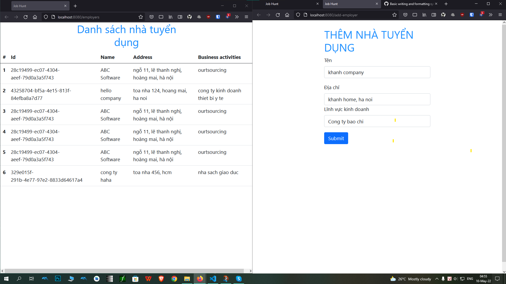
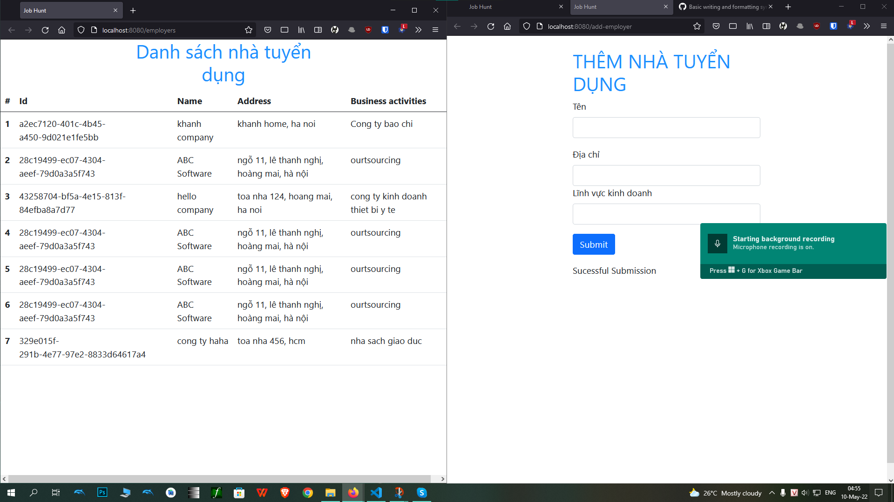
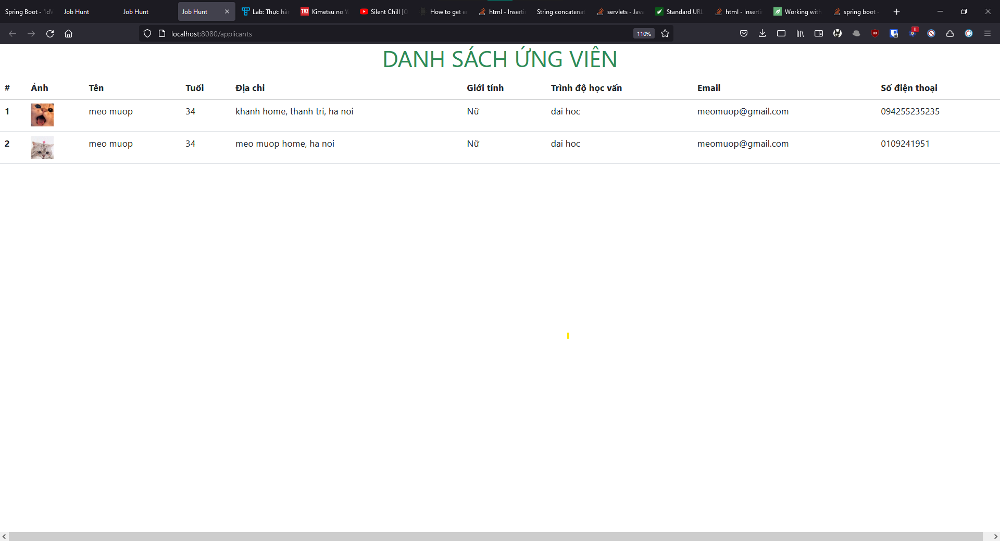

1.  trang chủ
    

2.  thử thêm nhà tuyển dụng
    

3.  nhả tuyển dụng được thêm vào danh sách
    

4.  thêm phần upload ảnh vào trang thêm ứng viên
    

         điền thêm thông tin

    

thì ta upload đc thông tin có cả ảnh vào repo

